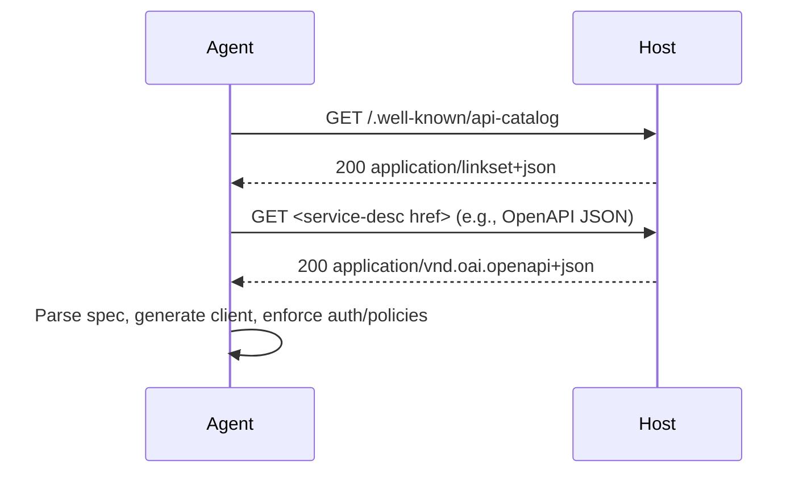

# @airnub/wellknown-api-catalog

[](https://github.com/airnub-labs/wellknown/blob/main/LICENSE)
[](https://www.npmjs.com/package/@airnub/wellknown-api-catalog)
[](https://www.npmjs.com/package/@airnub/wellknown-api-catalog)
[](https://github.com/airnub-labs/wellknown/actions/workflows/ci.yml)
[](https://airnub-labs.github.io/wellknown/)
[](https://www.typescriptlang.org/)

Publish an RFC 9727 `/.well-known/api-catalog` endpoint backed by Linkset JSON (RFC 9264) so humans, SDKs, and AI coding agents can discover the live API surface area of your host.

## Features

- **RFC-compliant** – Emits `application/linkset+json` with the `api-catalog` link relation and RFC 9727 profile header
- **Spec-agnostic** – Link to OpenAPI, AsyncAPI, GraphQL SDL, JSON Schema, or any other format via RFC 8631 service link relations
- **Proxy-aware** – Reconstructs externally-visible origin using `Forwarded` and `X-Forwarded-*` headers with trust-proxy support
- **Framework integrations** – Drop-in handlers for Express, Fastify, Next.js App Router, and Supabase Edge Functions
- **TypeScript native** – Fully typed with comprehensive IntelliSense support
- **Zero configuration** – Sensible defaults with automatic Content-Type, profile parameters, and Link headers
- **Helper functions** – Built-in helpers for OpenAPI, GraphQL, AsyncAPI, and JSON Schema with correct MIME types

## Installation

This package is currently in pre-release (`0.1.0-next.x`). Install via the `next` dist-tag until the first stable release:

```bash
npm install @airnub/wellknown-api-catalog@next
```

```bash
pnpm add @airnub/wellknown-api-catalog@next
```

## Quick Start

All RFC complexity (well-known paths, Content-Types, profile URIs) is handled automatically.

### Next.js App Router

Create `app/.well-known/api-catalog/route.ts`:

```ts
import { NextRequest, NextResponse } from 'next/server';
import { createNextApiCatalogRoutes } from '@airnub/wellknown-api-catalog';

export const { GET, HEAD } = createNextApiCatalogRoutes(
  {
    apis: [
      {
        id: 'my-api',
        basePath: '/api/v1',
        specs: [{ href: '/api/v1/openapi.json' }],
      },
    ],
  },
  NextRequest,
  NextResponse
);
```

### Express

```ts
import express from 'express';
import { registerExpressApiCatalog } from '@airnub/wellknown-api-catalog';

const app = express();

registerExpressApiCatalog(app, {
  apis: [
    {
      id: 'my-api',
      basePath: '/api/v1',
      specs: [{ href: '/api/v1/openapi.json' }],
    },
  ],
});
```

### Fastify

```ts
import Fastify from 'fastify';
import { registerFastifyApiCatalog } from '@airnub/wellknown-api-catalog';

const fastify = Fastify();

registerFastifyApiCatalog(fastify, {
  apis: [
    {
      id: 'my-api',
      basePath: '/api/v1',
      specs: [{ href: '/api/v1/openapi.json' }],
    },
  ],
});
```

### Supabase Edge Functions / Deno

Create `supabase/functions/api-catalog/index.ts`:

```ts
import { serve } from 'https://deno.land/std/http/server.ts';
import { createApiCatalogHandler } from 'npm:@airnub/wellknown-api-catalog';

serve(
  createApiCatalogHandler({
    apis: [
      {
        id: 'my-api',
        basePath: '/api/v1',
        specs: [{ href: '/api/v1/openapi.json' }],
      },
    ],
  })
);
```

Works with Supabase Edge Functions, Deno Deploy, Cloudflare Workers, and any Fetch API runtime.

## Overview

Agents increasingly rely on live HTTP calls, but today they often depend on hand-curated OpenAPI URLs, plugin manifests, or stale documentation. RFC 9727 introduces a single, predictable discovery point: `/.well-known/api-catalog`. When that endpoint returns a Linkset describing every API on a host, agents can:

1. `GET /.well-known/api-catalog`
2. Parse the `linkset` array (each entry is an API anchor)
3. Follow `service-desc` links to machine-readable specs (OpenAPI, GraphQL, AsyncAPI, JSON Schema…)
4. Fetch those specs to construct clients, tooling configs, or safety checks directly against your live infrastructure

No more guessing, scraping docs, or relying on out-of-date manifests.

## Usage

### Helper Functions

The package provides helper functions for common API specification formats with correct MIME types and profile URIs.

#### OpenAPI

```typescript
import { openApiSpec } from '@airnub/wellknown-api-catalog';

// OpenAPI 3.1 (default)
openApiSpec('/api/openapi.json');

// OpenAPI 3.0
openApiSpec('/api/openapi.json', '3.0');
```

#### GraphQL

```typescript
import { graphqlSchemaSpec } from '@airnub/wellknown-api-catalog';

// GraphQL SDL schema (default)
graphqlSchemaSpec('/api/schema.graphql');

// GraphQL introspection result
graphqlSchemaSpec('/api/introspection', { format: 'introspection' });
```

#### AsyncAPI

```typescript
import { asyncApiSpec } from '@airnub/wellknown-api-catalog';

// AsyncAPI 3.0 (default)
asyncApiSpec('/api/asyncapi.json');

// AsyncAPI 2.0
asyncApiSpec('/api/asyncapi.json', '2.0');
```

#### JSON Schema

```typescript
import { jsonSchemaSpec } from '@airnub/wellknown-api-catalog';

// JSON Schema 2020-12 (default)
jsonSchemaSpec('/api/schema.json');

// JSON Schema 2019-09
jsonSchemaSpec('/api/schema.json', '2019-09');

// JSON Schema draft-07
jsonSchemaSpec('/api/schema.json', '07');
```

### Linkset Output

`buildApiCatalogLinkset` returns a payload that mirrors RFC 9264:

```json
{
  "linkset": [
    {
      "anchor": "https://api.example.com/apis/service-one",
      "service-desc": [
        { "href": "/apis/service-one/openapi.json", "type": "application/vnd.oai.openapi+json" }
      ],
      "service-doc": [
        { "href": "https://docs.example.com/service-one", "type": "text/html" }
      ]
    }
  ],
  "linkset-metadata": [
    {
      "profile": "https://www.rfc-editor.org/info/rfc9727",
      "publisher": "example-publisher"
    }
  ]
}
```

Every API anchor is a fully-qualified origin plus base path with trailing slashes trimmed. Specs default to the `service-desc` relation (unless you override the `rel` per entry), and the metadata block announces the RFC 9727 profile plus the optional `publisher` you supply in the config.

### AI / Agent Workflow



## API Reference

### Express

#### `registerExpressApiCatalog(app, config)`

Registers GET and HEAD handlers at `/.well-known/api-catalog`.

```ts
import { registerExpressApiCatalog } from '@airnub/wellknown-api-catalog';

registerExpressApiCatalog(app, {
  publisher: 'my-company',
  apis: [
    {
      id: 'my-api',
      title: 'My API',
      basePath: '/api/v1',
      specs: [
        { href: '/api/v1/openapi.json', type: 'application/vnd.oai.openapi+json' },
        { rel: 'service-doc', href: 'https://docs.example.com', type: 'text/html' },
      ],
    },
  ],
});
```

#### `createExpressApiCatalogHandler(config)`

Low-level function that returns an Express request handler for GET requests.

```ts
import { createExpressApiCatalogHandler } from '@airnub/wellknown-api-catalog';

app.get('/.well-known/api-catalog', createExpressApiCatalogHandler(config));
```

#### `createExpressApiCatalogHeadHandler(config)`

Low-level function that returns an Express request handler for HEAD requests.

```ts
import { createExpressApiCatalogHeadHandler } from '@airnub/wellknown-api-catalog';

app.head('/.well-known/api-catalog', createExpressApiCatalogHeadHandler(config));
```

### Fastify

#### `registerFastifyApiCatalog(fastify, config)`

Registers GET and HEAD routes at `/.well-known/api-catalog`.

```ts
import { registerFastifyApiCatalog } from '@airnub/wellknown-api-catalog';

registerFastifyApiCatalog(fastify, {
  publisher: 'my-company',
  apis: [
    {
      id: 'my-api',
      title: 'My API',
      basePath: '/api/v1',
      specs: [
        { href: '/api/v1/openapi.json', type: 'application/vnd.oai.openapi+json' },
      ],
    },
  ],
});
```

#### `fastifyApiCatalogPlugin`

Fastify plugin for use with `fastify.register()`. Note: config must be wrapped in `{ config: ... }`.

```ts
import { fastifyApiCatalogPlugin } from '@airnub/wellknown-api-catalog';

await fastify.register(fastifyApiCatalogPlugin, { config });
```

### Next.js

#### `createNextApiCatalogRoutes(config, NextRequest, NextResponse)`

Returns GET and HEAD route handlers for Next.js App Router.

```ts
import { createNextApiCatalogRoutes } from '@airnub/wellknown-api-catalog';
import { NextRequest, NextResponse } from 'next/server';

export const { GET, HEAD } = createNextApiCatalogRoutes(
  config,
  NextRequest,
  NextResponse
);
```

### Framework-Agnostic

#### `createApiCatalogHandler(config)`

Returns a Fetch API handler (works with Deno, Cloudflare Workers, Supabase Edge Functions).

```ts
import { createApiCatalogHandler } from '@airnub/wellknown-api-catalog';

const handler = createApiCatalogHandler(config);
```

#### `buildApiCatalogLinksetForOrigin(config, origin)`

Low-level function that builds the Linkset JSON for a given origin.

```ts
import { buildApiCatalogLinksetForOrigin } from '@airnub/wellknown-api-catalog';

const linkset = buildApiCatalogLinksetForOrigin(config, 'https://api.example.com');
```

#### `createGetResponse(linkset, origin)`

Creates a GET response object with proper headers.

```ts
import { createGetResponse } from '@airnub/wellknown-api-catalog';

const response = createGetResponse(linkset, origin);
```

#### `createHeadResponse(origin)`

Creates a HEAD response object with proper headers.

```ts
import { createHeadResponse } from '@airnub/wellknown-api-catalog';

const response = createHeadResponse(origin);
```

### Constants

```ts
import {
  RFC9727_PROFILE,
  API_CATALOG_PATH,
  LINKSET_CONTENT_TYPE,
  API_CATALOG_LINK_REL,
} from '@airnub/wellknown-api-catalog';

console.log(RFC9727_PROFILE); // https://www.rfc-editor.org/info/rfc9727
console.log(API_CATALOG_PATH); // /.well-known/api-catalog
console.log(LINKSET_CONTENT_TYPE); // application/linkset+json; profile="..."
console.log(API_CATALOG_LINK_REL); // api-catalog
```

## Configuration

### Origin Strategies

Choose how anchors are materialized:

#### From Request (default)

Builds anchors from the incoming request with proxy support:

```ts
{
  originStrategy: {
    kind: 'fromRequest',
    trustProxy: true // or false, or IP/subnet list, or custom function
  }
}
```

`trustProxy` mirrors Express semantics:
- `true` – Trust all proxies
- `false` – Don't trust any proxies (default)
- Array of IP/subnet strings – Trust specific proxies (compatible with `proxy-addr` syntax)
- Function – Custom trust function

When trusted, `Forwarded` / `X-Forwarded-*` headers determine the scheme and host.

#### Fixed Origin

Hard-code the public origin (great for serverless functions or API gateways):

```ts
{
  originStrategy: {
    kind: 'fixed',
    origin: 'https://api.example.com',
    basePath: '/apis' // optional common prefix
  }
}
```

### API Configuration

Each API entry supports:

```ts
{
  id: 'unique-api-id',           // Required: unique identifier
  title: 'My API',                // Optional: human-readable title
  basePath: '/api/v1',            // Required: API base path
  absoluteAnchor: 'https://...',  // Optional: override computed anchor
  specs: [                        // Required: array of spec references
    {
      href: '/path/to/spec',      // Required: spec URL
      rel: 'service-desc',        // Optional: link relation (default: 'service-desc')
      type: 'application/json',   // Optional: MIME type
      profile: 'https://...',     // Optional: profile URI
    }
  ]
}
```

## Advanced Topics

### Security Considerations

`trustProxy` defaults to `false`. Only enable `trustProxy: true` (or whitelist addresses) when you control the proxy hop closest to your application. Otherwise an attacker could spoof `Forwarded` headers and publish incorrect origins. For zero-trust scenarios, keep `trustProxy: false` or use the `fixed` strategy so anchors always reflect your local listener configuration.

### Custom Framework Integration

For custom frameworks or edge runtimes, use the core builder functions:

```ts
import {
  buildApiCatalogLinksetForOrigin,
  createGetResponse,
  createHeadResponse,
} from '@airnub/wellknown-api-catalog';

function handleApiCatalog(request) {
  const origin = new URL(request.url).origin;
  const config = { apis: [...] };

  if (request.method === 'GET') {
    const linkset = buildApiCatalogLinksetForOrigin(config, origin);
    const response = createGetResponse(linkset, origin);
    return new Response(response.body, {
      status: response.status,
      headers: response.headers,
    });
  }

  if (request.method === 'HEAD') {
    const response = createHeadResponse(origin);
    return new Response(null, {
      status: response.status,
      headers: response.headers,
    });
  }
}
```

### How Agents Can Consume the Catalog

1. Fetch the catalog and iterate over `linkset` entries
2. Use `anchor` as the API base URL
3. Look for `service-desc` links; inspect `type` + `profile` to detect OpenAPI, GraphQL, JSON Schema, AsyncAPI, or custom specs
4. Download the spec, build runtime clients, or feed it to an LLM toolchain
5. Optional: follow `service-doc` for human docs, `status` for health endpoints, or `service-meta` for terms/auth notes

## Standards

This package implements the following RFCs:

- **RFC 9727** – Defines `/.well-known/api-catalog`, the `api-catalog` link relation, and the requirement to advertise catalogs with the `https://www.rfc-editor.org/info/rfc9727` profile
- **RFC 9264** – Specifies Linkset JSON (`application/linkset+json`), the payload format emitted by this package
- **RFC 8631** – Enumerates link relations like `service-desc`, `service-doc`, `service-meta`, and `status`
- **RFC 7239** – Details the `Forwarded` header used to safely reconstruct the externally-visible origin even when you sit behind proxies or CDNs

## Versioning

This package follows semantic versioning. Breaking changes to the config types or Linkset emission format will trigger a major version bump. Pin to the latest minor within a major stream for stability.

## Contributing

Contributions are welcome! Please see the [main repository](https://github.com/airnub-labs/wellknown) for contribution guidelines.

## License

Copyright © 2024-2025 Airnub Technologies Limited

Licensed under the Apache License, Version 2.0 (the "License"); you may not use this file except in compliance with the License. You may obtain a copy of the License at

    http://www.apache.org/licenses/LICENSE-2.0

Unless required by applicable law or agreed to in writing, software distributed under the License is distributed on an "AS IS" BASIS, WITHOUT WARRANTIES OR CONDITIONS OF ANY KIND, either express or implied. See the License for the specific language governing permissions and limitations under the License.

## Links

- **Documentation**: https://airnub-labs.github.io/wellknown/
- **Repository**: https://github.com/airnub-labs/wellknown
- **Issues**: https://github.com/airnub-labs/wellknown/issues
- **npm**: https://www.npmjs.com/package/@airnub/wellknown-api-catalog
