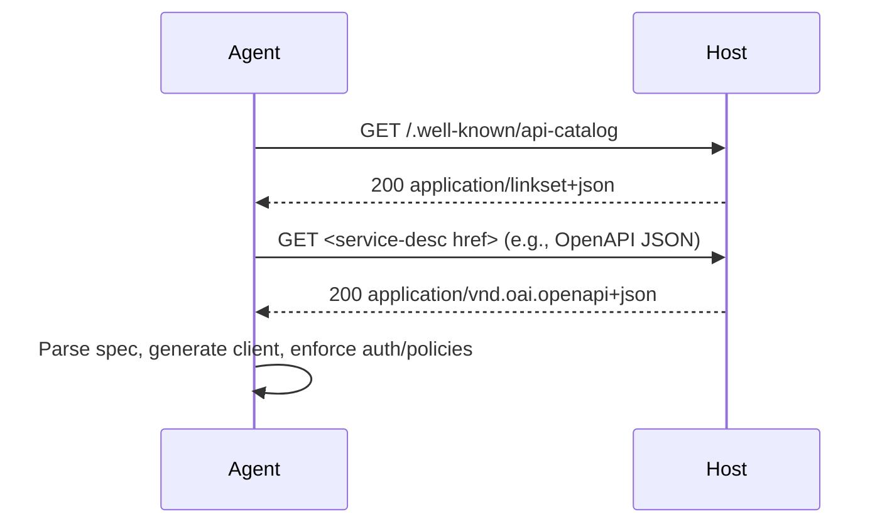

# @airnub/wellknown-api-catalog

[](https://github.com/airnub-labs/wellknown/blob/main/LICENSE)
[](https://www.npmjs.com/package/@airnub/wellknown-api-catalog)
[](https://www.npmjs.com/package/@airnub/wellknown-api-catalog)
[](https://github.com/airnub-labs/wellknown/actions/workflows/ci.yml)
[](https://airnub-labs.github.io/wellknown/)
[](https://www.typescriptlang.org/)

Publish an RFC 9727 `/.well-known/api-catalog` endpoint backed by Linkset JSON
(RFC 9264) so humans, SDKs, and AI coding agents can discover the live API
surface area of your host.

- **Spec-aligned** – emits `application/linkset+json` with the `api-catalog` link
  relation, `linkset-metadata` profile marker, and the RFC 9727 profile header.
- **Spec-agnostic** – link to OpenAPI, AsyncAPI, GraphQL SDL, JSON Schema, or
  any other document via the standard web API link relations from RFC 8631.
- **Proxy-aware** – reconstructs the externally-visible origin using
  `Forwarded`, `X-Forwarded-*`, and trust-proxy rules so you publish correct
  anchors even behind load balancers or CDNs.
- **Framework-ready** – drop-in handlers for Express and Fastify; simple helper
  functions for common spec formats.

## Why this matters for AI LLM / coding agents

Agents increasingly rely on live HTTP calls, but today they often depend on
hand-curated OpenAPI URLs, plugin manifests, or stale documentation. RFC 9727
introduces a single, predictable discovery point: `/.well-known/api-catalog`.
When that endpoint returns a Linkset describing every API on a host, agents can:

1. `GET /.well-known/api-catalog`
2. Parse the `linkset` array (each entry is an API anchor)
3. Follow `service-desc` links to machine-readable specs (OpenAPI, GraphQL,
   AsyncAPI, JSON Schema…)
4. Fetch those specs to construct clients, tooling configs, or safety checks
   directly against your live infrastructure.

No more guessing, scraping docs, or relying on out-of-date manifests.

## Standards background

- **RFC 9727** defines the API catalog well-known location,
  `rel="api-catalog"`, and the requirement to advertise the catalog via Linkset
  JSON with the `https://www.rfc-editor.org/info/rfc9727` profile.
- **RFC 9264** specifies Linkset JSON (`application/linkset+json`) – a structured
  way to publish sets of links grouped by anchor.
- **RFC 8631** enumerates link relations like `service-desc`, `service-doc`,
  `service-meta`, and `status`, which we use to connect anchors to specs,
  documentation, and status endpoints.
- **RFC 7239** (`Forwarded`) + `X-Forwarded-*` headers explain how proxies report
  the original host and scheme; the library uses `forwarded-http` + `proxy-addr`
  to safely rebuild origins when proxies are trusted.

## Installation

This package is currently in pre-release (`0.1.0-next.x`). Install via the
`next` dist-tag until the first stable release:

```bash
pnpm add @airnub/wellknown-api-catalog@next
# or
npm install @airnub/wellknown-api-catalog@next
```

## Quickstart

```ts
import type { ApiCatalogConfig } from '@airnub/wellknown-api-catalog';
import { openApiSpec, graphqlSchemaSpec } from '@airnub/wellknown-api-catalog';

export const catalogConfig: ApiCatalogConfig = {
  publisher: 'example-publisher',
  originStrategy: { kind: 'fromRequest', trustProxy: false },
  apis: [
    {
      id: 'example-service-one',
      title: 'Example Service One API',
      basePath: '/apis/service-one',
      specs: [
        openApiSpec('/apis/service-one/openapi.json', '3.1'),
        {
          rel: 'service-doc',
          href: 'https://docs.example.com/service-one',
          type: 'text/html',
          title: 'HTML docs',
        },
      ],
    },
    {
      id: 'example-service-two',
      title: 'Example Service Two API',
      basePath: '/apis/service-two',
      specs: [graphqlSchemaSpec('/apis/service-two/schema.graphql')],
    },
  ],
};
```

### Express

```ts
import express from 'express';
import {
  createExpressApiCatalogHandler,
  createExpressApiCatalogHeadHandler,
} from '@airnub/wellknown-api-catalog';
import { catalogConfig } from './catalog-config';

const app = express();

app.get('/.well-known/api-catalog', createExpressApiCatalogHandler(catalogConfig));
app.head('/.well-known/api-catalog', createExpressApiCatalogHeadHandler(catalogConfig));
```

The HEAD handler reuses your origin strategy so it emits the same `Content-Type`
and `Link: rel="api-catalog"` headers as the GET handler—just without a body.

### Fastify

```ts
import Fastify from 'fastify';
import { fastifyApiCatalogPlugin } from '@airnub/wellknown-api-catalog';
import { catalogConfig } from './catalog-config';

const fastify = Fastify();
await fastify.register(fastifyApiCatalogPlugin, { config: catalogConfig });
```

The plugin registers both GET and HEAD routes with identical headers so your
catalog stays compliant whether clients fetch metadata or just probe the
endpoint.

### Using with Next.js App Router

When you're building a route handler under `app/.well-known/api-catalog/route.ts`,
derive the origin from `NextRequest.url` and feed it into the framework-agnostic
`buildApiCatalogLinksetForOrigin` helper:

```ts
// app/.well-known/api-catalog/route.ts
import { NextRequest, NextResponse } from 'next/server';
import type { ApiCatalogConfig } from '@airnub/wellknown-api-catalog';
import {
  buildApiCatalogLinksetForOrigin,
  openApiSpec,
} from '@airnub/wellknown-api-catalog';

const catalogConfig: ApiCatalogConfig = {
  publisher: 'example-publisher',
  apis: [
    {
      id: 'example-service-one',
      title: 'Example Service One API',
      basePath: '/api/service-one',
      specs: [openApiSpec('/api/service-one/openapi.json', '3.1')],
    },
  ],
};

const RFC9727_PROFILE = 'https://www.rfc-editor.org/info/rfc9727';

export function GET(request: NextRequest) {
  const origin = new URL(request.url).origin;
  const linkset = buildApiCatalogLinksetForOrigin(catalogConfig, origin);

  return NextResponse.json(linkset, {
    headers: {
      'Content-Type': `application/linkset+json; profile="${RFC9727_PROFILE}"`,
    },
  });
}

export function HEAD(request: NextRequest) {
  const origin = new URL(request.url).origin;
  const url = `${origin}/.well-known/api-catalog`;

  return new NextResponse(null, {
    headers: {
      'Content-Type': `application/linkset+json; profile="${RFC9727_PROFILE}"`,
      Link: `<${url}>; rel="api-catalog"`,
    },
  });
}
```

`buildApiCatalogLinksetForOrigin` takes a plain `origin` string, so it works in
both Edge and Node runtimes without relying on Node's `IncomingMessage`.

### Using with Supabase Edge Functions (Deno)

Supabase Edge Functions run on Deno and expose the standard Fetch API. Import
the package via the npm compatibility layer and reuse the same helper:

```ts
// supabase/functions/api-catalog/index.ts
import { serve } from 'https://deno.land/std/http/server.ts';
import {
  buildApiCatalogLinksetForOrigin,
  openApiSpec,
  type ApiCatalogConfig,
} from 'npm:@airnub/wellknown-api-catalog';

const catalogConfig: ApiCatalogConfig = {
  publisher: 'example-publisher',
  apis: [
    {
      id: 'example-service-one',
      title: 'Example Service One API',
      basePath: '/api/service-one',
      specs: [openApiSpec('/api/service-one/openapi.json', '3.1')],
    },
  ],
};

const RFC9727_PROFILE = 'https://www.rfc-editor.org/info/rfc9727';

serve((request: Request): Response => {
  const url = new URL(request.url);

  if (url.pathname !== '/.well-known/api-catalog') {
    return new Response('Not found', { status: 404 });
  }

  const origin = url.origin;
  const linkset = buildApiCatalogLinksetForOrigin(catalogConfig, origin);

  if (request.method === 'HEAD') {
    return new Response(null, {
      headers: {
        'Content-Type': `application/linkset+json; profile="${RFC9727_PROFILE}"`,
        Link: `<${origin}/.well-known/api-catalog>; rel="api-catalog"`,
      },
    });
  }

  return new Response(JSON.stringify(linkset), {
    headers: {
      'Content-Type': `application/linkset+json; profile="${RFC9727_PROFILE}"`,
    },
  });
});
```

By staying within the Fetch API surface area you avoid Node-specific globals and
keep the same catalog logic across Express, Fastify, Next.js, and Supabase.

## Linkset output

`buildApiCatalogLinkset` returns a payload that mirrors RFC 9264:

```json
{
  "linkset": [
    {
      "anchor": "https://api.example.com/apis/service-one",
      "service-desc": [
        { "href": "/apis/service-one/openapi.json", "type": "application/vnd.oai.openapi+json" }
      ],
      "service-doc": [
        { "href": "https://docs.example.com/service-one", "type": "text/html" }
      ]
    }
  ],
  "linkset-metadata": [
    {
      "profile": "https://www.rfc-editor.org/info/rfc9727",
      "publisher": "example-publisher"
    }
  ]
}
```

Every API anchor is a fully-qualified origin plus base path with trailing slashes
trimmed. Specs default to the `service-desc` relation (unless you override the
`rel` per entry), and the metadata block announces the RFC 9727 profile plus the
optional `publisher` you supply in the config.

### AI / agent workflow



## Origin strategies

Choose how anchors are materialised:

- `{ kind: 'fromRequest', trustProxy }` – builds anchors from the incoming
  request. `trustProxy` mirrors Express semantics: `true`, `false`, a list of
  IP/subnet strings (compatible with `proxy-addr` syntax), or a custom function.
  When trusted, `Forwarded` / `X-Forwarded-*` headers decide the scheme + host.
- `{ kind: 'fixed', origin, basePath? }` – hard-code the public origin, great
  for serverless functions or API gateways that always present the same domain.

You can also supply `originStrategy.basePath` to prefix every anchor with a
common path (e.g., `/apis`). Individual APIs can override the final anchor with
`absoluteAnchor`.

## Security considerations

`trustProxy` defaults to `false`. Only enable `trustProxy: true` (or whitelist
addresses) when you control the proxy hop closest to your application.
Otherwise an attacker could spoof `Forwarded` headers and publish incorrect
origins. For zero-trust scenarios, keep `trustProxy: false` or use the `fixed`
strategy so anchors always reflect your local listener configuration.

## How agents can consume the catalog

1. Fetch the catalog and iterate over `linkset` entries.
2. Use `anchor` as the API base URL.
3. Look for `service-desc` links; inspect `type` + `profile` to detect OpenAPI,
   GraphQL, JSON Schema, AsyncAPI, or custom specs.
4. Download the spec, build runtime clients, or feed it to an LLM toolchain.
5. Optional: follow `service-doc` for human docs, `status` for health endpoints,
   or `service-meta` for terms/auth notes.

## Versioning

This package follows semantic versioning. Breaking changes to the config types
or Linkset emission format will trigger a major version bump. Pin to the latest
minor within a major stream for stability.

---

## License

Copyright © 2024-2025 Airnub Technologies Limited

Licensed under the Apache License, Version 2.0 (the "License");
you may not use this file except in compliance with the License.
You may obtain a copy of the License at

    http://www.apache.org/licenses/LICENSE-2.0

Unless required by applicable law or agreed to in writing, software
distributed under the License is distributed on an "AS IS" BASIS,
WITHOUT WARRANTIES OR CONDITIONS OF ANY KIND, either express or implied.
See the License for the specific language governing permissions and
limitations under the License.
