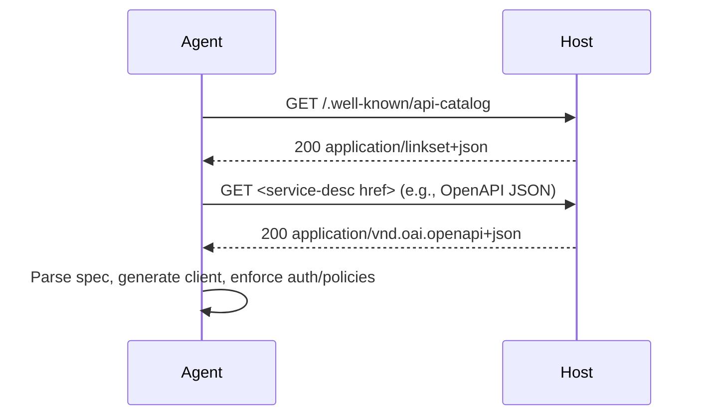

# @airnub/wellknown-api-catalog

Publish an RFC 9727 `/.well-known/api-catalog` endpoint backed by Linkset JSON
(RFC 9264) so humans, SDKs, and AI coding agents can discover the live API
surface area of your host.

- **Spec-aligned** – emits `application/linkset+json` with the `api-catalog` link
  relation, `linkset-metadata` profile marker, and the RFC 9727 profile header.
- **Spec-agnostic** – link to OpenAPI, AsyncAPI, GraphQL SDL, JSON Schema, or
  any other document via the standard web API link relations from RFC 8631.
- **Proxy-aware** – reconstructs the externally-visible origin using
  `Forwarded`, `X-Forwarded-*`, and trust-proxy rules so you publish correct
  anchors even behind load balancers or CDNs.
- **Framework-ready** – drop-in handlers for Express and Fastify; simple helper
  functions for common spec formats.

## Why this matters for AI LLM / coding agents

Agents increasingly rely on live HTTP calls, but today they often depend on
hand-curated OpenAPI URLs, plugin manifests, or stale documentation. RFC 9727
introduces a single, predictable discovery point: `/.well-known/api-catalog`.
When that endpoint returns a Linkset describing every API on a host, agents can:

1. `GET /.well-known/api-catalog`
2. Parse the `linkset` array (each entry is an API anchor)
3. Follow `service-desc` links to machine-readable specs (OpenAPI, GraphQL,
   AsyncAPI, JSON Schema…)
4. Fetch those specs to construct clients, tooling configs, or safety checks
   directly against your live infrastructure.

No more guessing, scraping docs, or relying on out-of-date manifests.

## Standards background

- **RFC 9727** defines the API catalog well-known location,
  `rel="api-catalog"`, and the requirement to advertise the catalog via Linkset
  JSON with the `https://www.rfc-editor.org/info/rfc9727` profile.
- **RFC 9264** specifies Linkset JSON (`application/linkset+json`) – a structured
  way to publish sets of links grouped by anchor.
- **RFC 8631** enumerates link relations like `service-desc`, `service-doc`,
  `service-meta`, and `status`, which we use to connect anchors to specs,
  documentation, and status endpoints.
- **RFC 7239** (`Forwarded`) + `X-Forwarded-*` headers explain how proxies report
  the original host and scheme; the library uses `forwarded-http` + `proxy-addr`
  to safely rebuild origins when proxies are trusted.

## Installation

This package is currently in pre-release (`0.1.0-next.x`). Install via the
`next` dist-tag until the first stable release:

```bash
pnpm add @airnub/wellknown-api-catalog@next
# or
npm install @airnub/wellknown-api-catalog@next
```

## Quickstart

All RFC complexity (well-known paths, Content-Types, profile URIs) is handled automatically.

### Express (Simplified)

```ts
import express from 'express';
import { registerExpressApiCatalog } from '@airnub/wellknown-api-catalog';

const app = express();

// That's it! GET and HEAD handlers auto-registered at /.well-known/api-catalog
registerExpressApiCatalog(app, {
  apis: [
    {
      id: 'my-api',
      basePath: '/api/v1',
      specs: [{ href: '/api/v1/openapi.json' }],
    },
  ],
});
```

### Fastify (Simplified)

```ts
import Fastify from 'fastify';
import { registerFastifyApiCatalog } from '@airnub/wellknown-api-catalog';

const fastify = Fastify();

// That's it! GET and HEAD handlers auto-registered at /.well-known/api-catalog
registerFastifyApiCatalog(fastify, {
  apis: [
    {
      id: 'my-api',
      basePath: '/api/v1',
      specs: [{ href: '/api/v1/openapi.json' }],
    },
  ],
});
```

### Next.js App Router (Simplified)

Create `app/.well-known/api-catalog/route.ts`:

```ts
import { NextRequest, NextResponse } from 'next/server';
import { createNextApiCatalogRoutes } from '@airnub/wellknown-api-catalog';

// All RFC complexity handled automatically!
export const { GET, HEAD } = createNextApiCatalogRoutes(
  {
    apis: [
      {
        id: 'my-api',
        basePath: '/api/v1',
        specs: [{ href: '/api/v1/openapi.json' }],
      },
    ],
  },
  NextRequest,
  NextResponse
);
```

### Supabase Edge Functions / Deno (Simplified)

Create `supabase/functions/api-catalog/index.ts`:

```ts
import { serve } from 'https://deno.land/std/http/server.ts';
import { createApiCatalogHandler } from 'npm:@airnub/wellknown-api-catalog';

// All RFC complexity handled automatically!
serve(
  createApiCatalogHandler({
    apis: [
      {
        id: 'my-api',
        basePath: '/api/v1',
        specs: [{ href: '/api/v1/openapi.json' }],
      },
    ],
  })
);
```

Works with Supabase Edge Functions, Deno Deploy, Cloudflare Workers, and any Fetch API runtime.

## Linkset output

`buildApiCatalogLinkset` returns a payload that mirrors RFC 9264:

```json
{
  "linkset": [
    {
      "anchor": "https://api.example.com/apis/service-one",
      "service-desc": [
        { "href": "/apis/service-one/openapi.json", "type": "application/vnd.oai.openapi+json" }
      ],
      "service-doc": [
        { "href": "https://docs.example.com/service-one", "type": "text/html" }
      ]
    }
  ],
  "linkset-metadata": [
    {
      "profile": "https://www.rfc-editor.org/info/rfc9727",
      "publisher": "example-publisher"
    }
  ]
}
```

Every API anchor is a fully-qualified origin plus base path with trailing slashes
trimmed. Specs default to the `service-desc` relation (unless you override the
`rel` per entry), and the metadata block announces the RFC 9727 profile plus the
optional `publisher` you supply in the config.

### AI / agent workflow



## Helper Functions

The package provides helper functions for common API specification formats:

### OpenAPI

```typescript
import { openApiSpec } from '@airnub/wellknown-api-catalog';

// OpenAPI 3.1 (default)
openApiSpec('/api/openapi.json');

// OpenAPI 3.0
openApiSpec('/api/openapi.json', '3.0');
```

Generates a spec reference with the correct MIME type (`application/vnd.oai.openapi+json`) and version-specific profile URI.

### GraphQL

```typescript
import { graphqlSchemaSpec } from '@airnub/wellknown-api-catalog';

// GraphQL SDL schema (default)
graphqlSchemaSpec('/api/schema.graphql');

// GraphQL introspection result
graphqlSchemaSpec('/api/introspection', { format: 'introspection' });
```

Supports both SDL (Schema Definition Language) format and introspection query results.

### AsyncAPI

```typescript
import { asyncApiSpec } from '@airnub/wellknown-api-catalog';

// AsyncAPI 3.0 (default)
asyncApiSpec('/api/asyncapi.json');

// AsyncAPI 2.0
asyncApiSpec('/api/asyncapi.json', '2.0');
```

For event-driven and asynchronous API specifications.

### JSON Schema

```typescript
import { jsonSchemaSpec } from '@airnub/wellknown-api-catalog';

// JSON Schema 2020-12 (default)
jsonSchemaSpec('/api/schema.json');

// JSON Schema 2019-09
jsonSchemaSpec('/api/schema.json', '2019-09');

// JSON Schema draft-07
jsonSchemaSpec('/api/schema.json', '07');
```

Supports multiple JSON Schema drafts with correct profile URIs.

## Advanced Usage

The simplified APIs above cover most use cases. If you need more control, use the lower-level functions:

### Express (Advanced)

```ts
import express from 'express';
import {
  createExpressApiCatalogHandler,
  createExpressApiCatalogHeadHandler,
} from '@airnub/wellknown-api-catalog';

const app = express();

const config = {
  publisher: 'my-company',
  originStrategy: { kind: 'fromRequest', trustProxy: true },
  apis: [
    {
      id: 'my-api',
      title: 'My API',
      basePath: '/api/v1',
      specs: [
        { href: '/api/v1/openapi.json', type: 'application/vnd.oai.openapi+json' },
        { rel: 'service-doc', href: 'https://docs.example.com', type: 'text/html' },
      ],
    },
  ],
};

app.get('/.well-known/api-catalog', createExpressApiCatalogHandler(config));
app.head('/.well-known/api-catalog', createExpressApiCatalogHeadHandler(config));
```

### Fastify (Advanced - Plugin Style)

If you need the Fastify plugin pattern (e.g., for plugin composition or scoped configuration):

```ts
import Fastify from 'fastify';
import { fastifyApiCatalogPlugin } from '@airnub/wellknown-api-catalog';

const fastify = Fastify();

const config = {
  publisher: 'my-company',
  originStrategy: { kind: 'fromRequest', trustProxy: true },
  apis: [
    {
      id: 'my-api',
      title: 'My API',
      basePath: '/api/v1',
      specs: [
        { href: '/api/v1/openapi.json', type: 'application/vnd.oai.openapi+json' },
        { rel: 'service-doc', href: 'https://docs.example.com', type: 'text/html' },
      ],
    },
  ],
};

// Plugin style requires wrapping config in { config: ... }
await fastify.register(fastifyApiCatalogPlugin, { config });
```

Note: For most use cases, `registerFastifyApiCatalog(fastify, config)` is simpler.

### Framework-Agnostic

For custom frameworks or edge runtimes, use the core builder functions:

```ts
import {
  buildApiCatalogLinksetForOrigin,
  createGetResponse,
  createHeadResponse,
} from '@airnub/wellknown-api-catalog';

// In any HTTP handler
function handleApiCatalog(request) {
  const origin = new URL(request.url).origin;
  const config = { apis: [...] };

  if (request.method === 'GET') {
    const linkset = buildApiCatalogLinksetForOrigin(config, origin);
    const response = createGetResponse(linkset, origin);
    return new Response(response.body, {
      status: response.status,
      headers: response.headers,
    });
  }

  if (request.method === 'HEAD') {
    const response = createHeadResponse(origin);
    return new Response(null, {
      status: response.status,
      headers: response.headers,
    });
  }
}
```

### Accessing RFC Constants

If you need the RFC constants (for custom implementations or testing):

```ts
import {
  RFC9727_PROFILE,
  API_CATALOG_PATH,
  LINKSET_CONTENT_TYPE,
  API_CATALOG_LINK_REL,
} from '@airnub/wellknown-api-catalog';

console.log(RFC9727_PROFILE); // https://www.rfc-editor.org/info/rfc9727
console.log(API_CATALOG_PATH); // /.well-known/api-catalog
console.log(LINKSET_CONTENT_TYPE); // application/linkset+json; profile="..."
console.log(API_CATALOG_LINK_REL); // api-catalog
```

## Origin strategies

Choose how anchors are materialised:

- `{ kind: 'fromRequest', trustProxy }` – builds anchors from the incoming
  request. `trustProxy` mirrors Express semantics: `true`, `false`, a list of
  IP/subnet strings (compatible with `proxy-addr` syntax), or a custom function.
  When trusted, `Forwarded` / `X-Forwarded-*` headers decide the scheme + host.
- `{ kind: 'fixed', origin, basePath? }` – hard-code the public origin, great
  for serverless functions or API gateways that always present the same domain.

You can also supply `originStrategy.basePath` to prefix every anchor with a
common path (e.g., `/apis`). Individual APIs can override the final anchor with
`absoluteAnchor`.

## Security considerations

`trustProxy` defaults to `false`. Only enable `trustProxy: true` (or whitelist
addresses) when you control the proxy hop closest to your application.
Otherwise an attacker could spoof `Forwarded` headers and publish incorrect
origins. For zero-trust scenarios, keep `trustProxy: false` or use the `fixed`
strategy so anchors always reflect your local listener configuration.

## How agents can consume the catalog

1. Fetch the catalog and iterate over `linkset` entries.
2. Use `anchor` as the API base URL.
3. Look for `service-desc` links; inspect `type` + `profile` to detect OpenAPI,
   GraphQL, JSON Schema, AsyncAPI, or custom specs.
4. Download the spec, build runtime clients, or feed it to an LLM toolchain.
5. Optional: follow `service-doc` for human docs, `status` for health endpoints,
   or `service-meta` for terms/auth notes.

## Versioning

This package follows semantic versioning. Breaking changes to the config types
or Linkset emission format will trigger a major version bump. Pin to the latest
minor within a major stream for stability.
